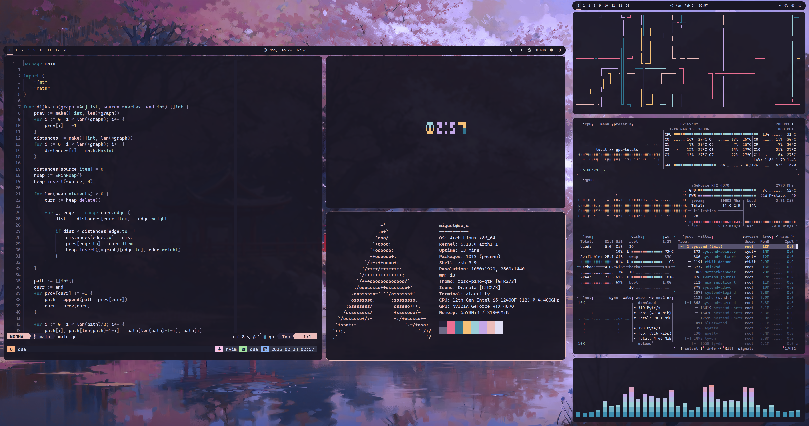

# Welcome



## Icons

To have icons in terminal/neovim, you need a [patched font](https://www.nerdfonts.com/font-downloads).

## GPG Key Issue

```
rm -r /etc/pacman.d/gnupg
pacman-key --init
pacman-key --populate archlinux
```

## Create Live ISO

```bash
sudo dd if=/path/to/.iso of=/usb/path bs=1M status=progress
```

## Mount them drives

1. List available drives

```
lsblk or sudo fdisk -l
```

2. Make mmount point directory

```
sudo mkdir -p /path/to/mount/
```

3. Verify mount

```
df -h
```

4. Edit /etc/fstab to mount automatically on boot

```
/dev/<sdXn>  /mnt/<your drive name>  <file system (listed on lsblk. windows is ntfs-3)>  <permissions. use "defaults" without quotes if you're not sure. gives rw access>  <fsck. check the disk on boot. 0=not checked>  <dump. how often filesystem is backed up. 0=not backed up>
```

## Backup guide

[Backup guide](https://ubuntuforums.org/showthread.php?t=35087)
_still yet to do this_

## GTK Dark Theme on i3

Cleanest way I managed to set up dark mode is to download a theme and use lxappearance
to manage them. This will generate ~/.gtkrc-2.0 and ~/.config/gtk-3.0/settings.ini.
However, changing cursor theme in lxappearance does not work for me.

To change the mouse cursor, I made an ~/.Xresources file:

```
Xcursor.theme: theme-here
Xcursor.size: size
```

You can get the cursor theme name by first setting it up on lxappearance, then open
~/.gtkrc-2.0 and copy the gtk-cursor-theme-name.

More information about [GTK](https://wiki.archlinux.org/title/GTK#Theme_not_applied_to_root_applications)
and [dark mode switching](https://wiki.archlinux.org/title/Dark_mode_switching#:~:text=Toolkits-,GTK,has%20the%20variant%20Adwaita%2Ddark%20.)

## Task Scheduler

### systemd/Timers

Follow the [wiki](https://wiki.archlinux.org/title/Systemd/Timers)

Create .service file

```systemd
/etc/systemd/system/task.service

[Unit]
Description=your-description

[Service]
ExecStart=/path/to/script
```

Create .time file

```systemd
/etc/systemd/system/task.timer

[Unit]
Description=your-description

[Timer]
OnCalendar=*-*-* 22:00 (means everyday at 22:00:00)
Persistent=true

[Install]
WantedBy=timers.target
```

Enable the service

```bash
sudo systemctl enable task.timer
```

### Using Crontab (for Ubuntu)

Sytnax:

```bash
crontab -e

# inside crontab (note * represents every possible value)
minute hour date month week path/to/script
```

If the script needs to be sudo, add sudo in front of the path to scripts.

To not show a prompt, edit sudoers:

```bash
sudo visudo

# inside visudo, replace username with your username duh
username ALL=(ALL) NOPASSWD: /path/to/script/
```

## Multi-Monitor Setup on Login

My workaround:

1. Sign in via Ubuntu rather than i3wm
2. Set up your monitors in the settings
3. Copy this display config to gdm3

```
sudo cp ~/.config/monitors.xml /var/lib/gdm3/.config
```

## Issues

### Booting Problems (so far experienced one booting problem)

- nvidia persistence daemon failed
    - [this guide worked](https://community.frame.work/t/solved-ubuntu-wont-boot-hangs-when-displaying-logs/29148)
    - On Grub, go to Advanced Options for Ubuntu (might be called something a little different)
    - Scroll to an option that says (recovery) at the end of the listing and press enter.
    - Wait for the magenta screen with a list of options to show up, then select the option that says “root” and says something about going into a terminal or bash or something.
    - run sudo apt update, sudo apt upgrade
    - run sudo apt-get install --reinstall ubuntu-desktop
    - then sudo reboot

### Package Install Error

E: The package <package-name> needs to be reinstalled, but I can't find an archive for it.

```
sudo dpkg --remove --force-all <package-name>
```

### Connect Controller via Bluetooth

```
# Disconnect your gamepad with blueman and remove the device
bluetoothctl
scan on
devices
# copy the MAC of the device that you want to pair
pair MAC_ADDRESS
trust MAC_ADDRESS
connect MAC_ADDRESS
```

[source](https://github.com/bluez/bluez/issues/673#issuecomment-1849132576)

### Get Qt5 Apps To Use Native Gtk+ Style

```
sudo apt install qt5-style-plugins
echo "export QT_QPA_PLATFORMTHEME=gtk2" >> ~/.profile
```

[source](<[https://github.com/bluez/bluez/issues/673#issuecomment-1849132576](https://www.linuxuprising.com/2018/05/get-qt5-apps-to-use-native-gtk-style-in.html)>)

## FOR LAPTOP

**Add this for touchpad and other keybinds**

```
# Pulse Audio controls
bindsym XF86AudioRaiseVolume exec --no-startup-id pactl set-sink-volume 0 +5% #increase sound volume
bindsym XF86AudioLowerVolume exec --no-startup-id pactl set-sink-volume 0 -5% #decrease sound volume
bindsym XF86AudioMute exec --no-startup-id pactl set-sink-mute 0 toggle # mute sound

# Sreen brightness controls
bindsym XF86MonBrightnessUp exec xbacklight -inc 20 # increase screen brightness
bindsym XF86MonBrightnessDown exec xbacklight -dec 20 # decrease screen brightness

# Touchpad controls
bindsym XF86TouchpadToggle exec /some/path/toggletouchpad.sh # toggle touchpad

# Media player controls
bindsym XF86AudioPlay exec playerctl play
bindsym XF86AudioPause exec playerctl pause
bindsym XF86AudioNext exec playerctl next
bindsym XF86AudioPrev exec playerctl previous
```

**Enable one tap click for laptop**

Add the following code in /etc/X11/xorg.conf.d/90-touchpad.conf

```
Section "InputClass"
        Identifier "touchpad"
        MatchIsTouchpad "on"
        Driver "libinput"
        Option "Tapping" "on"
        Option "NaturalScrolling" "true"
        Option "TappingButtonMap" "lrm" # 1/2/3 finger, for 3-finger middle lrm
EndSection
```

**Pinch to zoom in/out**

Install dependencies:

```
sudo apt install libinput xdotool
yay -S libinput-gestures-git
```

Make sure user is in input group

```
sudo usermod -aG input <username>
```

Add the following to ~/.config/libinput-gestures.conf:

```bash
gesture pinch in   xdotool key ctrl+minus
gesture pinch out  xdotool key ctrl+plus
```

To start the gestures:

```
libinput-gestures-setup autostart #run automatically on the startup
libinput-gestures-setup start
libinput-gestures-setup status #check if its running
```

Try restarting along the way if libinput-gestures-setup can't start

Check more information on [libinput-gestures](https://github.com/bulletmark/libinput-gestures)

**Reverse Touchpad Scroll (Natural Scrolling)**

Add the following to /etc/X11/xorg.conf.d/30-libinput.conf then restart

```conf
Section "InputClass"
    Identifier "libinput touchpad"
    Driver "libinput"
    Option "Tapping" "on"
    Option "NaturalScrolling" "false"
EndSection
```

### TMUX

**Colors**

Run echo $TERM

On tmux.conf add:

```
set-option -a terminal-features '<change to $TERM value>:RGB'
```

You can also set the $TERM varibale to your desired value e.g. "xterm-256color:RGB" on bashrc. On alacritty it's running 'alacritty' and I dont like the undercurl it gives.

```
export TERM=xterm-256color
```

**TMUX Sessioniser**

Add this code on .bashrc for tmux sessionizer to work

- For bash

```bash
function ctrl_f_search() {~~
    /bin/.local/scripts/tmux-sessionizer
}

bind -x '"\C-f": ctrl_f_search'
```

- For zsh

```bash
bindkey -s "^F" "tmux-sessionizer\n"
```

_Note to self_

To change default shell:

```bash
chsh -s $(which zsh)
```

**Plugins**

You need tmux plugin manager to install plugins for tmux. **Remember to specify which folder you save it**

```
git clone https://github.com/tmux-plugins/tpm.git <PATH>
```

## Neovim:

I am using [packer.nvim](https://github.com/wbthomason/packer.nvim) to handle my plugins. You need to clone it first before being able to install plugins.

## Others

#### LibreWolf Advanced Preferences (via about:config)

```
browser.sessionstore.resume_from_crash = false
```

#### Spicetify Theme Cannot Be Found

If you installed it from the AUR, themes was on a different dir.

Create a symbolic link

```bash
ln -s /usr/share/spicetify-cli/Themes/* /home/miguel/.config/spicetify/Themes/
```
